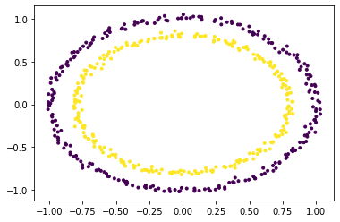
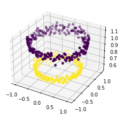

```python
import numpy as np
import matplotlib.pyplot as plt
from sklearn.datasets import make_circles
from mpl_toolkits.mplot3d import Axes3D
```


```python
X,Y=make_circles(n_samples=500,noise=0.02)
```


```python
plt.scatter(X[:,0],X[:,1],c=Y,marker='.')
plt.show()
```





```python
X1=X[:,0].reshape((-1,1))
X2=X[:,1].reshape((-1,1))
X3=(X1**2 +X2**2)
X=np.hstack((X,X3))
#visualizing data in higher dimension
fig=plt.figure()
axes=fig.add_subplot(111,projection='3d')
axes.scatter(X1,X2,X1**2+X2**2,c=Y,depthshade=True)
plt.show()
```





```python

```


```python

```


```python


```


```python

```
